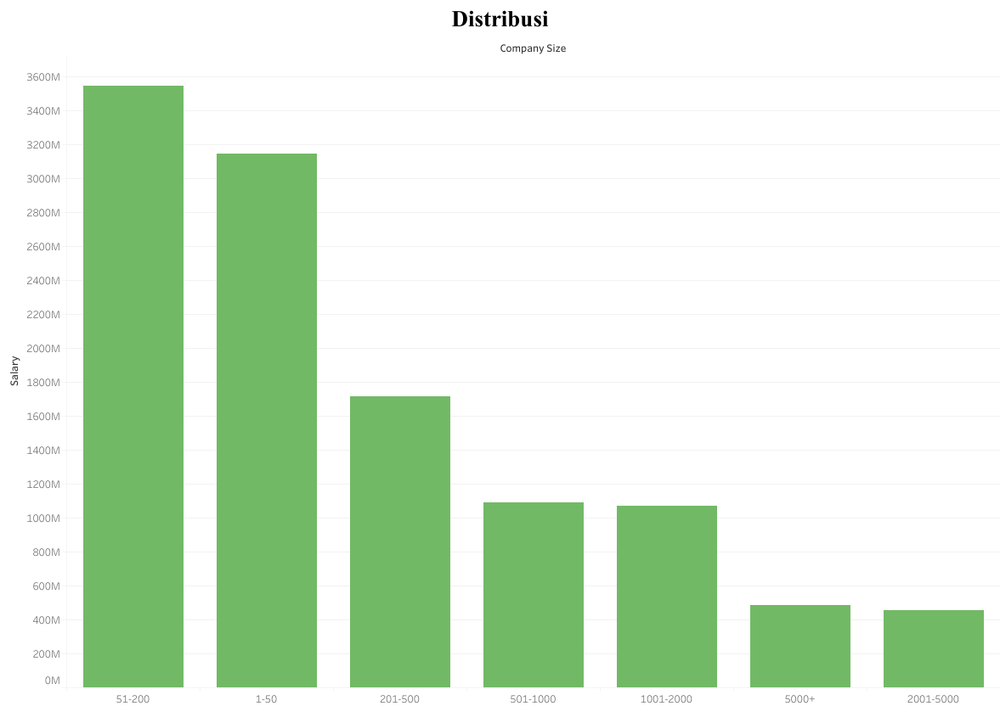
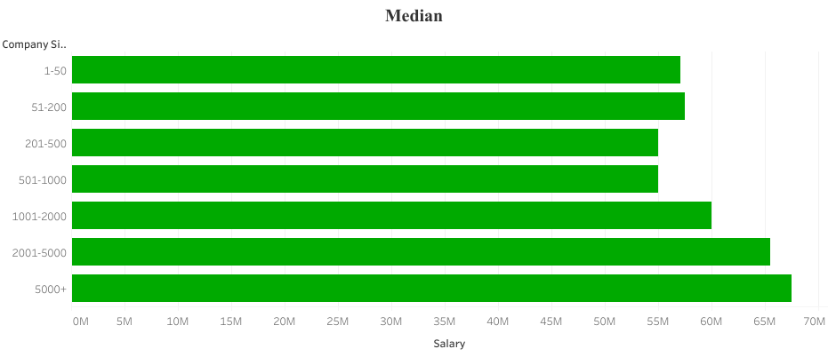
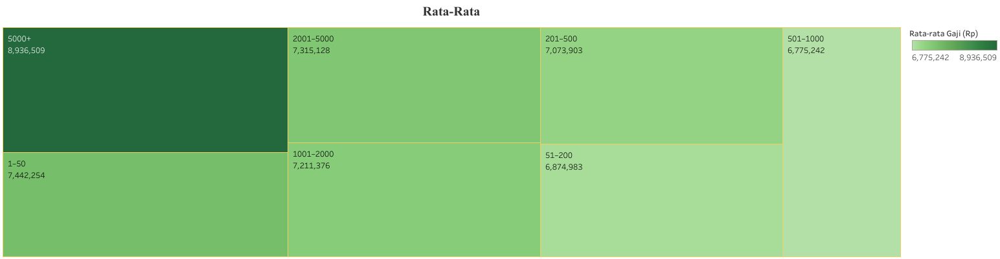
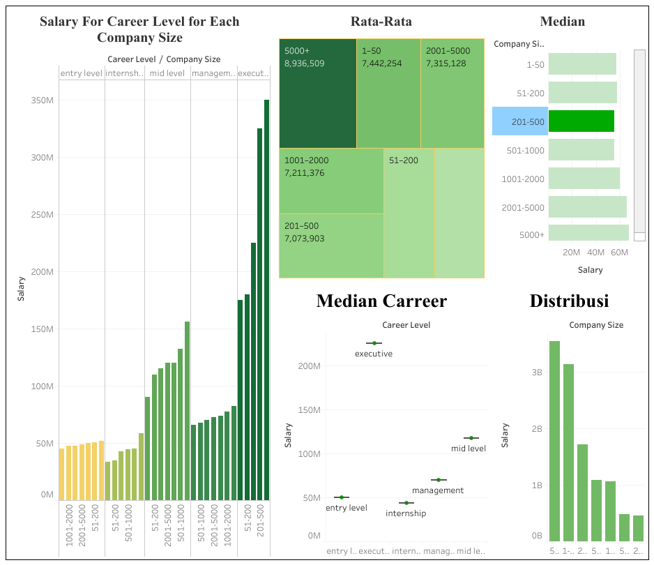

# company-size-vs-salary
Data analysis project exploring how company size impacts employee salaries in Indonesia. Includes data preprocessing, visualization, and insights using Tableau and Python.

## 📊 Overview

Many people assume that **larger companies always offer higher salaries** but is that really true?  
Through this analysis, we aim to discover whether **company size significantly influences employee pay** and how it correlates with **career levels**.

---

## 🧠 Objectives
- Analyze the **relationship** between company size and employee salaries  
- Compare **median and average salaries** across company scales  
- Identify how **career levels** (Internship → Executive) affect salary trends  
- Present findings visually through **interactive Tableau dashboards**

---

## 📁 Dataset
- **Source:** [Kaggle Job Description and Salary in Indonesia](https://www.kaggle.com/datasets/canggih/jog-description-and-salary-in-indonesia?select=test.csv)
- **Data Type:** CSV file containing job descriptions, company size, and salary information  
- **Scope:** Salaries from various industries and company sizes across Indonesia  

---

## 🧰 Tools Used
| Tool | Purpose |
|------|----------|
| 🐍 **Python (Pandas, NumPy)** | Data cleaning and preprocessing |
| 🐍 **Python (Matplotlib, Seaborn)** | Plotting and visualization |
| 📊 **Tableau Public** | Visualization and dashboard creation |
| 📘 **Jupyter Notebook** | Analysis and experimentation |
| 💾 **Kaggle Dataset** | Source of raw data |

---

## ⚙️ Data Preprocessing
- Handled missing or inconsistent data entries  
- Cleaned company size categories  
- Removed outliers for better visualization   

See pre processing ipynb file here :
[data_preprocessing.ipynb](https://github.com/edricemerson/company-size-vs-salary/blob/main/data_preprocessing.ipynb)

## ⚙️ Data analysis, Data Visualization and Plotting with matplotlib & Tableau

See the whole ipynb file here :
[ProjectData_Analytics.ipynb](https://github.com/edricemerson/company-size-vs-salary/blob/main/ProjectData_Analytics.ipynb)

---

## 📈 Visualizations (Tableau Public)
Explore the interactive dashboards here:  
- [Distribution by Company Size](https://public.tableau.com/app/profile/aaron.adriano/viz/DataAnalytics_17496557297130/Sheet1?publish=yes)  
- [Median Salary per Company Size](https://public.tableau.com/app/profile/aaron.adriano/viz/DataAnalytics2_17496558226180/Sheet2?publish=yes)  
- [Average Salary Treemap](https://public.tableau.com/app/profile/aaron.adriano/viz/DataAnalyticsData3/Sheet3?publish=yes)  
- [Career Level Median Salary](https://public.tableau.com/app/profile/aaron.adriano/viz/DataAnalytics4_17496560193200/Sheet4)  
- [Dashboard Overview](https://public.tableau.com/app/profile/aaron.adriano/viz/DataAnalyticsDashboard_17496561131440/Dashboard1)  

  
## Picture of Tableau ( Non Interactive )

  
### Distribution by Company Size

### Median Salary per Company Size

### Average Salary Treemap

### Career Level Median Salary

### Dashboard Overview

---

## 📊 Key Insights
- **Career level** is the strongest factor affecting salary growth.  
- **Company size** acts as a multiplier large companies amplify higher-level salaries.  
- **Small and medium companies** sometimes offer competitive pay to attract key talent.  
- Data inconsistencies suggest further validation is needed for salary extremes.  

---
